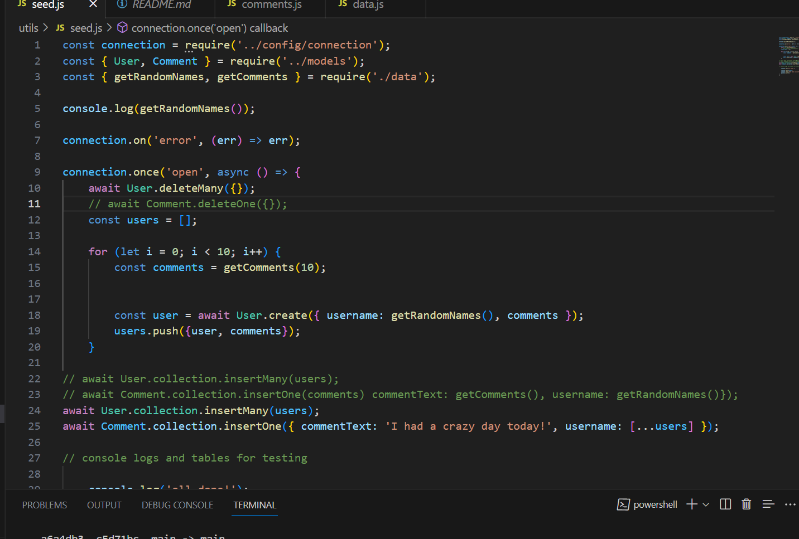

# Social-Media-API
An API for a social media site that uses NoSQL

 ## Table of Contents
 ---
  - [Description](#Description)
  - [Image](#Image)
  - [Challenges](#Challenges)
  - [Installation](#Installation)
  - [Technologies](#Technologies)
  - [License](#License)
  - [Contributors](#Contributors)
  - [Tests](#Tests)
  - [Contact](#Contact)
  - [Github](#github)
  - [Questions](#questions)
  
  ## Description
  ---
  Store, update, delete, and track user information in this social media API. This API uses NoSQL to store data in a MongoDB database. The API uses Mongoose to connect to the database and Express.js to handle routes. The API is tested using Insomnia Core.

  ## ScreenShot
  ---
  

  ## Video of passing tests
  ---
 [Walkthrough Video](https://app.castify.com/view/ec084d16-cb47-4474-a19b-c98a9fce64f8)

  ## Technologies
  ---
  Node.js, Inquirer, Javascript, Mysql2, tableConsole, dotenv

  ## Contributors
  ---
  Sachi Takaoka

  ## Credit
  ---
  Tutor: Sachin Jhaveri

  ## Contact
  ---
  sasa@gmail.com

  ## Github
  ---
  - [https://kaleikautakaoka.github.io](https://github.com/kaleikautakaoka/)
  - [https://github.com/kaleikautakaoka/MY-SVG](https://github.com/kaleikautakaoka/Organization-Management)

  ## Resources
  ---
[MySql](https://dev.mysql.com/doc/)
[Mysql Server](https://dev.mysql.com/doc/refman/8.0/en/help.html)
[tutorialspot](https://www.tutorialspoint.com/mysql/mysql-select-database.html)
[w3schools](https://www.w3schools.com/mysql/mysql_select.asp)
[stackoverflow](https://stackoverflow.co/teams/?utm_source=adwords&utm_medium=ppc&utm_campaign=kb_teams_search_nb_dsa_targeted_audiences_namer&_bt=658164167919&_bk=&_bm=&_bn=g&gclid=CjwKCAjw-vmkBhBMEiwAlrMeF6t62u2_YPgOhZlqF8IaB6aH_RpLce6VnEaeK-T8AYuyqca1LnhevhoCKTwQAvD_BwE)
[packt](https://subscription.packtpub.com/book/web-development/9781788395540/11/ch11lvl1sec66/organizing-test-with-describe)
[Node.js](https://nodejs.org/en)
[inquirer](https://www.npmjs.com/package/inquirer)
[mozilladeveloper](https://developer.mozilla.org/en-US/docs/Learn)
[Youtube](https://www.youtube.com/)
[stackoverflow](https://stackoverflow.co/teams/?utm_source=adwords&utm_medium=ppc&utm_campaign=kb_teams_search_nb_dsa_targeted_audiences_namer&_bt=658164167919&_bk=&_bm=&_bn=g&gclid=CjwKCAjw-vmkBhBMEiwAlrMeF6t62u2_YPgOhZlqF8IaB6aH_RpLce6VnEaeK-T8AYuyqca1LnhevhoCKTwQAvD_BwE)
[packt](https://subscription.packtpub.com/book/web-development/9781788395540/11/ch11lvl1sec66/organizing-test-with-describe)

### Walkthrough Video: 37%

* A walkthrough video that demonstrates the functionality of the social media API must be submitted, and a link to the video should be included in your README file.

  * The walkthrough video must show all of the technical acceptance criteria being met.

  * The walkthrough video must demonstrate how to start the application’s server.

  * The walkthrough video must demonstrate GET routes for all users and all thoughts being tested in Insomnia.

  * The walkthrough video must demonstrate GET routes for a single user and a single thought being tested in Insomnia.

  * The walkthrough video must demonstrate POST, PUT, and DELETE routes for users and thoughts being tested in Insomnia.

  * Walkthrough video must demonstrate POST and DELETE routes for a user’s friend list being tested in Insomnia.

  * Walkthrough video must demonstrate POST and DELETE routes for reactions to thoughts being tested in Insomnia.

### Technical Acceptance Criteria: 40%

* Satisfies all of the preceding acceptance criteria plus the following:

  * Uses the [Mongoose package](https://www.npmjs.com/package/mongoose) to connect to a MongoDB database.

  * Includes User and Thought models outlined in the Challenge instructions.

  * Includes schema settings for User and Thought models as outlined in the Challenge instructions.

  * Includes Reactions as the `reaction` field's subdocument schema in the Thought model.

  * Uses functionality to format queried timestamps properly.

### Repository Quality: 13%

* Repository has a unique name.

* Repository follows best practices for file structure and naming conventions.

* Repository follows best practices for class/id naming conventions, indentation, quality comments, etc.

* Repository contains multiple descriptive commit messages.

* Repository contains a high-quality README with description and a link to a walkthrough video.

### Bonus: +10 Points

* Application deletes a user's associated thoughts when the user is deleted.
